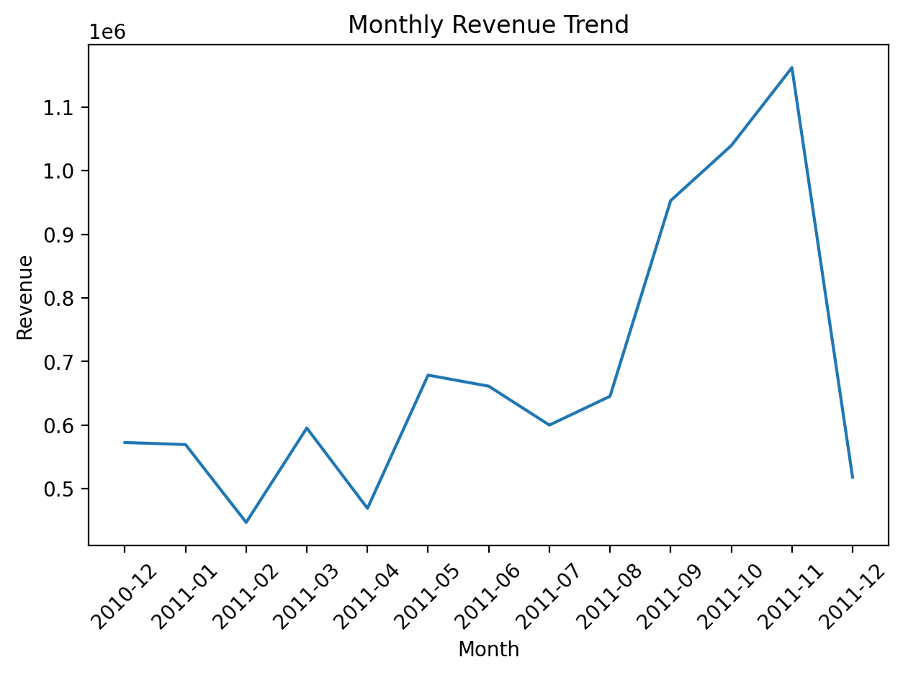
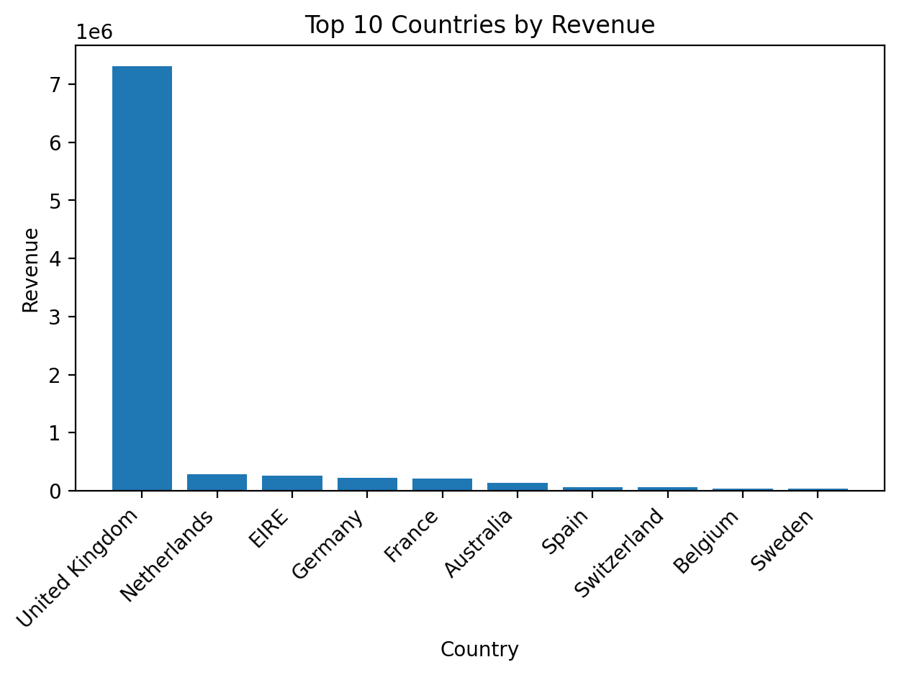
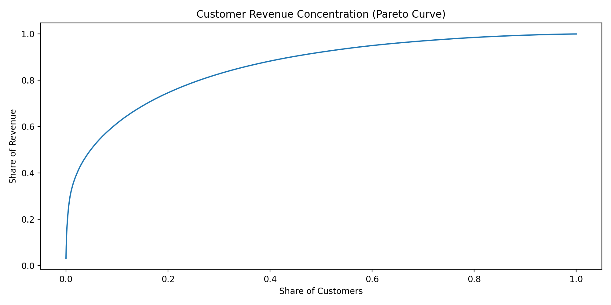

# 📊 E-Commerce Revenue Analytics (SQL + Python)


---

## Overview

This project performs an end-to-end revenue analysis on over **500,000 real-world e-commerce transactions** using **SQL and Python**.

The objective is to simulate the workflow of a data analyst by:

- Cleaning and validating raw transactional data  
- Designing SQL queries to extract business KPIs  
- Performing time-series revenue analysis  
- Identifying geographic and customer revenue concentration  
- Translating findings into actionable business insights  

---

## Dataset

The dataset contains transactional records from an online retail company.

Each row represents:

- One product purchased  
- Within a single invoice  
- By a specific customer  
- At a specific timestamp  

**Original size:** ~540,000 transactions  
**Cleaned dataset:** ~397,000 valid transactions  

### Data Cleaning Process

- Removed missing `CustomerID` records  
- Filtered out cancellations and refunds  
- Converted data types (dates, numeric fields)  
- Engineered `Revenue = Quantity × UnitPrice`  
- Loaded cleaned data into SQLite for querying  

---

## Tools & Technologies

- **Python** (Pandas, Matplotlib)
- **SQLite**
- **SQL**
- **Git & GitHub**

---

## Business Questions Answered

1. What is total company revenue?
2. How does revenue trend over time?
3. Which countries generate the most revenue?
4. Who are the top customers by total spend?
5. How concentrated is revenue across customers?

---

## Key Insights

- **Revenue is highly concentrated geographically:** The United Kingdom accounts for ~82% of total revenue.
- **Strong seasonality detected:** Revenue peaks in November 2011 (~£1.16M), suggesting Q4 demand surge.
- **Customer concentration effect:** A small percentage of customers generate a disproportionately large share of total revenue.
- **Growth trend:** Revenue steadily increased throughout 2011 prior to the Q4 peak.

---

## Example Visualizations

### Monthly Revenue Trend



---

### Top 10 Countries by Revenue



---

### Customer Revenue Concentration (Pareto Analysis)



---

## SQL Analysis Layer

Reusable SQL queries are stored in:

```
sql/analysis_queries.sql
```

Example:

```sql
SELECT Country, SUM(Revenue) AS total_revenue
FROM sales
GROUP BY Country
ORDER BY total_revenue DESC
LIMIT 10;
```

---

## How to Run

1. Clone the repository:

```bash
git clone <repo-url>
```

2. Install dependencies:

```bash
pip install -r requirements.txt
```

3. Open the notebook in:

```
/notebooks/01_data_cleaning.ipynb
```

4. Run all cells

---

## Project Structure

```
data/                   # Raw and cleaned data
images/                 # Saved visualizations
notebooks/              # Analysis notebook
sql/                    # Reusable SQL queries
README.md
requirements.txt
.gitignore
```

---

## Why This Project Matters

This project demonstrates:

- End-to-end data cleaning & transformation
- SQL-based KPI extraction
- Time-series revenue analysis
- Geographic and customer revenue segmentation
- Business-focused interpretation of data
- Clean repository structuring and documentation

---

## Author

**Mika Garber**  
Aspiring Data Analyst / Data Scientist